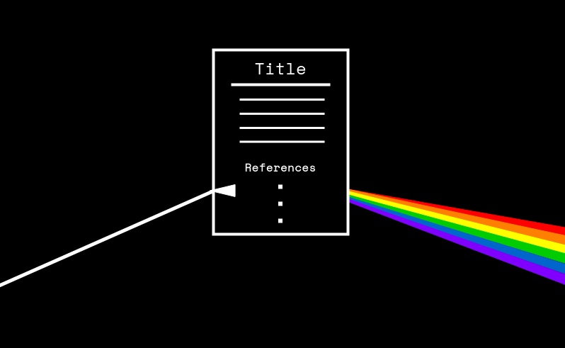

# OpenAlex-CitedReferences

[](https://mybinder.org/v2/gh/eschares/OpenAlex-CitedReferences/main)

This project uses Python, [Jupyter Notebooks](https://jupyter.org/) and the [OpenAlex API](https://docs.openalex.org/) to collect, clean, and examine open data on cited references for Iowa State University in the year 2021.

## :bulb: Motivation
We would like to better understand how campus researchers use journal content.
Analyzing which years our authors cite and how many papers they cite gives us a better feel for how content is being used.
We can use this information as we make journal cancellation and renewal decisions. Research questions include:
- How often do researchers from a university cite a particular journal?
- What years are those cited references from, and when was the reference made?
- Does the usage justify paying for backfile access to a journal, or do our researchers tend to use more recent content?

<div align="center">
  
</div>

## :triangular_ruler: Structure
This repository contains two main folders:

* **`notebooks`**: This folder contains Jupyter notebooks that gather, process and analyze the input data. These notebooks contain Python code and markdown cells that describe the data processing steps and results.
  * The first notebook `1-Pull_the_data_OpenAlex-citedreferences.ipynb` presents an overview of the data collection process using the OpenAlex API. The data will be stored in local files within the `files` directory, so we can repeat and modify the data exploration without having to download the data again and again, saving us time and the OpenAlex API work.

  * The second notebook `2-Graph_and_explore_data_OpenAlex-citedreferences.ipynb` conducts an in-depth analysis of the collected data, illuminating various key aspects through insightful plots and analyses. By employing these exploratory techniques, the notebook effectively answers the research questions that were posed earlier.

* **`files/ISU_2021_fullyear`**: This folder contains the input data gathered in the first notebook that is used in the second notebook:
  * the file `publications.csv` stores the metadata about all publications from Iowa State University in 2021
  * the file `references.csv` stores the metadata about all references listed in the publications' bibliographies
  * the file `pub2ref.csv` stores the connections between the publications and their references

## :horse_racing: Running the notebooks

*Note: You can browse through the notebooks right here on GitHub. However, the code snippets won't be executable.*

### Cloud services
The easiest way to run Jupyter notebooks is via cloud services like [Binder](https://mybinder.org/). They provide you with a free execution environment that you can access directly in your browser - no setup needed. Just click on the Binder badge at the top of this README!

### Local environment
If you are familiar with the command-line and Python, you can also set up a local environment on your computer to run the notebooks.

Clone this repository and change into its folder
```Bash
git clone https://github.com/eschares/OpenAlex-CitedReferences.git
cd OpenAlex-CitedReferences
```
Create a virtual environment and activate it
```Bash
python3 -m venv jupyterenv
source jupyterenv/bin/activate
```
Install the Python packages `jupyter` and `jupyterlab`
```Bash
python3 -m pip install jupyter jupyterlab
```
Install the Python packages specified in `requirements.txt`
```Bash
python3 -m pip install -r requirements.txt
```

Start the Jupyter server
```Bash
jupyter lab
```

If everything went well, a new tab in your browser should pop up showing you the contents of this repo in a Jupyter environment.

### IDE
Many integrated development environments also support running Jupyter notebooks out of the box or via a plugin. If you have one installed, you may want to consult its docs or marketplace.

## :ant: Known bugs
OpenAlex is a very useful open scholarly database, but it is still evolving. As such, executing the notebooks at different points in time may yield different results, and bugs may appear which were not present in January 2023 when this data was downloaded and processed. To be as transparent as possible, we will list problems that arise when executing the notebooks here as we become aware of them:

### Some time soon
The field `host_venue` of an OpenAlex work object is [deprecated](https://docs.openalex.org/api-entities/works/work-object#host_venue-deprecated). We use it to extract the publisher, journal and issn of each reference and publication. The notebook will have to be adapted to use the new field [`primary_location`](https://docs.openalex.org/api-entities/works/work-object#primary_location) instead.

### 2023-04-16
We noticed that some references do not exist anymore in OpenAlex. For example the OpenAlex ID "W4362225795" is [referenced in other works](http://api.openalex.org/works?filter=cites:W4362225795), but [querying OpenAlex for the entity](http://api.openalex.org/works/W4362225795) results in a "404-not found" error.  We notified the OpenAlex support about it (support ID #241).

### 2023-04-13
We noticed that there is a difference between retrieved and expected references. Some requests to the OpenAlex API fetching 50 references using the approach outlined in the [OurResearch blog](https://blog.ourresearch.org/fetch-multiple-dois-in-one-openalex-api-request/) did not return 50 entities but 49 or sometimes 48. We notified the OpenAlex support about it (support ID #238).
