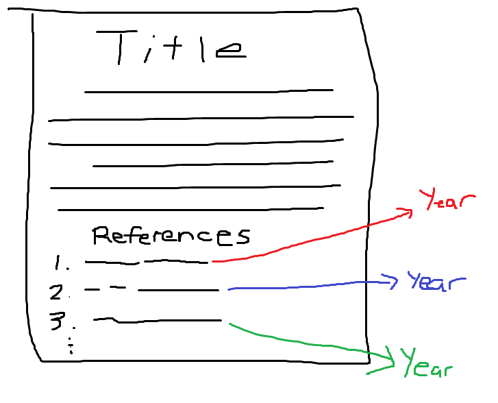

# OpenAlex-CitedReferences

This project uses Python, Jupyter Notebooks, and the OpenAlex API to collect, clean, and examine open data on cited references. 

Research questions include: 
- How often do researchers from a university cite a particular journal?
- What years are those cited references from, and when was the reference made?
- Does the usage justify paying for backfile access to a journal, or do our researchers tend to use more recent content?

